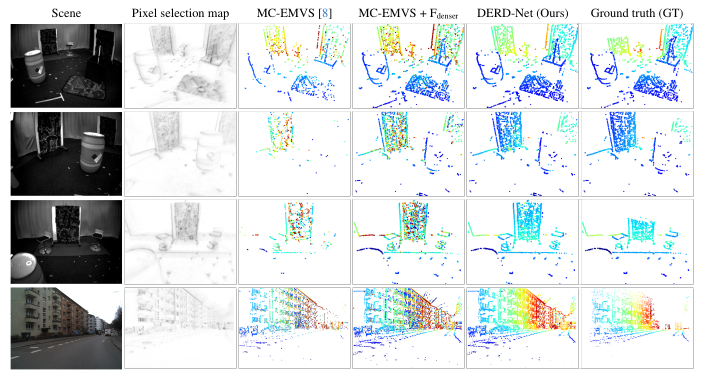

# Learning Depth from Event-based Ray Densities

This repository accompanies our conference paper, "Learning Depth from Event-based Ray Densities." The objective is to estimate depth from event-camera data using a blend of geometric and learning-based approaches. Events are first processed into disparity space images (DSIs), from which pixels with high confidence are selected. Around each of these confident pixels, we extract a local subregion of the DSI (Sub-DSI). These Sub-DSIs are then passed to a 3D-Convolutional GRU neural network, which estimates pixel-wise depth, achieving significant improvements over prior state-of-the-art (SOTA) methods in stereo as well as monocular settings.

### Data-Preprocessing

The events are processed into disparity space images (DSIs), which represent the potential depth of each pixel across multiple disparity levels by counting the rays passing through each voxel, projected from the pixel where an event was triggered. In stereo event vision, DSIs from two or more cameras can be fused, eliminating the need for event synchronization between cameras. This reduces complexity and enables more robust depth estimation. This approach was originally proposed in the [MC-EMVS](https://onlinelibrary.wiley.com/doi/10.1002/aisy.202200221) paper. To construct DSIs, refer to the associated repository, [dvs_mcemvs](https://github.com/tub-rip/dvs_mcemvs).

### Input

To ensure reliable depth estimation, we apply an adaptive Gaussian threshold filter to each DSI, filtering for pixels with a sufficiently high ray count. For each selected pixel, a local sub-area around it is extracted from the DSI and normalized. These extracted regions, or Sub-DSIs, serve as the input for the neural network.

### Neural Network

The neural network architecture is a 3D-Convolutional GRU. Each Sub-DSI first undergoes a 3D convolution to capture geometric patterns and enhance generalization. Following this, each depth layer is fed sequentially to a GRU. Because the Sub-DSI consists of ray counts projected from the representative camera position into space, each depth layer depends on the previous one. Consequently, the last hidden state captures the embedding of all 3D geometric data in a 2D matrix. Finally, two fully connected layers map this embedding to the network output.

### Output

We present two versions of the network, identical in architecture except for their last layer. In the single-pixel version, the network estimates the depth at the selected pixel, positioned centrally within the Sub-DSI. In the multi-pixel version, the output is a 3x3 grid, providing depth estimates for the selected pixel as well as its adjacent pixels.

### Performance

On the MVSEC <em>indoor_flying</em> sequence, our approach outperforms the state-of-the-art (SOTA) DSI-based method, reducing the mean absolute error (MAE) by 40% when applying the same filter to both methods. Compared to the SOTA non-DSI approach, we achieve a reduction in MAE of over 47%. Additionally, by applying a less strict filter, our method increases the number of depth-estimated pixels by a factor of 3.88, while still providing SOTA results. On this expanded set of pixels, our approach achieves an MAE 22% lower than the MAE of the SOTA DSI method on its original, much smaller set of pixels. The superiority of our method was further confirmed by retraining and testing on the DSEC sequence <em>zurich_city_04a</em>.

### Usage Instructions

The code for our approach is provided in Jupyter Notebooks within the `notebooks` folder. Below are instructions for each key notebook:

- **Training and Testing**: Use the `training_and_testing` notebook to train models on DSIs created from event-camera data and evaluate the model performance. Each step in this notebook guides you through the entire training and testing process.
- **Inference**: To generate depth estimates for new data, use the `inference` notebook, which provides step-by-step guidance on performing inference with trained models.
- **Visualization**: The `visualization` notebook enables you to visualize results, making it easy to compare predictions with ground truth data and analyze model performance.

Additionally, the code is available as NumPy files. After adjusting file paths to match your directories, these can be executed directly for training, inference, or visualization without the need for Jupyter.
